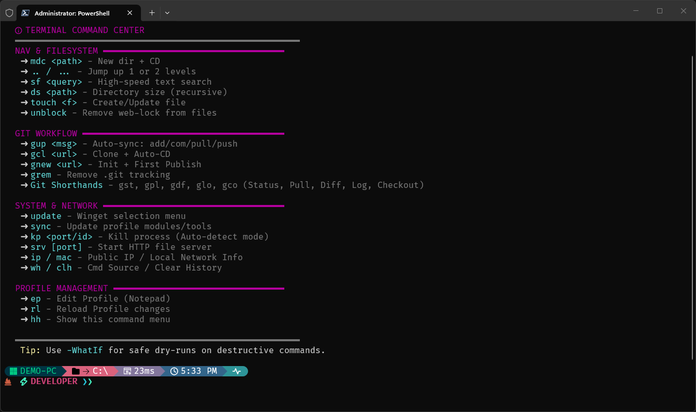

# ⚡ Supercharged Terminal
### A Modern Terminal Configuration for Windows


<br>


*Above: The fully configured terminal running Oh My Posh and Terminal Icons.*

<br>

## ✨ Features

- **Git Integration**: View branch, status, and changes directly in your prompt.
- **Intelligent Autocomplete**: Predicts commands as you type based on history.
- **Custom Utilities**: Built-in functions like `mkcd`, `touch`, `killport`, and more.
- **Themeable**: Powered by Oh My Posh with easy theme switching.

<br>


<br>

## ⚠️ PREREQUISITE: Install Fonts First
> [!IMPORTANT]
> **You MUST install a Nerd Font before running this setup.**
> Without a Nerd Font, your terminal icons will appear as broken squares (□).
>
> 1. Download a font like **CaskaydiaCove** or **Meslo** from [NerdFonts.com](https://www.nerdfonts.com/font-downloads).
> 2. Install the `.ttf` files.
> 3. Open Terminal Settings -> **Appearance** -> Set **Font Face** to the new font.

<br>


<br>

## 📖 Overview
This repository transitions your standard Windows terminal into a professional development cockpit. It provides **Git integration**, **intelligent autocomplete**, **syntax highlighting**, and **custom developer utilities**.

### 📋 Table of Contents
1. [🚀 Quick Start (Auto-Install)](#-quick-start)
2. [🛠 Manual Installation](#-manual-installation)
3. [⚙️ Profile Configuration](#-profile-configuration)
4. [⚡ Command Dictionary](#-command-dictionary)
5. [🎨 Themes & Customization](#-themes--customization)

<br>


<br>

## 🚀 Quick Start
**Automate the entire setup process.**
The included master script checks for Admin privileges, configures Git safety nets, and sets up your profile automatically.

### Instructions
1.  Download the **[`install.ps1`](./install.ps1)** script from this repository.
2.  Right-click the downloaded file and select **"Run with PowerShell"**.
3.  Follow the on-screen prompts.

> [!TIP]
> **Run as Administrator:** For the smoothest experience, run the script as an Administrator to prevent antivirus interruptions.

> [!NOTE]
> If the script closes immediately or fails to run, open a terminal in the folder and run:
> ```powershell
> Set-ExecutionPolicy Bypass -Scope Process -Force; .\install.ps1
> ```

<br>


<br>

## 🛠 Manual Installation
If you prefer to configure your environment step-by-step, follow this guide.

### 1. Prerequisites
* **PowerShell 7:** [Install via Microsoft Store or Winget]
    ```powershell
    winget install Microsoft.PowerShell
    ```
* **Nerd Font:** (See the alert at the top of this page).

### 2. Install Core Tools
Run these commands in an **Administrator** terminal:

```powershell
# Install Git, Theme Engine, and Sudo tool
winget install Git.Git
winget install JanDeDobbeleer.OhMyPosh
winget install gsudo

# Install PowerShell Modules
Install-Module -Name Terminal-Icons -Repository PSGallery -Force
Install-Module -Name PSReadLine -Repository PSGallery -Force -AllowPrerelease
```

### 3. Install Themes
Manually download and extract the theme pack:

```powershell
$themePath = "$env:LOCALAPPDATA\Programs\oh-my-posh\themes"
New-Item -ItemType Directory -Path $themePath -Force | Out-Null
Invoke-WebRequest -Uri "https://github.com/JanDeDobbeleer/oh-my-posh/releases/latest/download/themes.zip" -OutFile "$themePath\themes.zip"
Expand-Archive -Path "$themePath\themes.zip" -DestinationPath $themePath -Force
Remove-Item "$themePath\themes.zip"
```

<br>


<br>

## ⚙️ Profile Configuration
The `Microsoft.PowerShell_profile.ps1` file controls your aliases and custom functions.

**Setup:**
1.  Attempt to open your profile by typing: `notepad $PROFILE`
> [!NOTE]
> If you see a "Path not found" error, run this command to create the file first:
> ```powershell
> New-Item -Path $PROFILE -Type File -Force
> ```
2.  Paste the code block below into Notepad.
3.  Save and restart your terminal.

<details>
<summary><strong>🔽 Click to View Full Profile Code</strong></summary>

```powershell
# -------------------------------
# 1. Modules & Setup
# -------------------------------
Import-Module -Name Terminal-Icons
Import-Module -Name PSReadLine

# Theme Configuration
$env:POSH_THEMES_PATH = "$env:LOCALAPPDATA\Programs\oh-my-posh\themes"
oh-my-posh init pwsh --config "$env:POSH_THEMES_PATH\montys.omp.json" | Invoke-Expression

# -------------------------------
# 2. Intelligent Autocomplete
# -------------------------------
Set-PSReadLineOption -PredictionViewStyle InlineView
Set-PSReadLineOption -PredictionSource HistoryAndPlugin
Set-PSReadLineKeyHandler -Key Tab -Function MenuComplete
Set-PSReadLineKeyHandler -Key UpArrow -Function HistorySearchBackward
Set-PSReadLineKeyHandler -Key DownArrow -Function HistorySearchForward

# -------------------------------
# 3. Coder Utilities
# -------------------------------
function mkcd { param($Path) New-Item -ItemType Directory -Path $Path -Force | Out-Null; Set-Location $Path }
function touch { param($Path) if(Test-Path $Path){(Get-Item $Path).LastWriteTime=Get-Date}else{$null>$Path} }
function which { param($Name) Get-Command $Name -ErrorAction SilentlyContinue | Select-Object -ExpandProperty Source }
function update { winget upgrade --all }

function killport { 
    param([int]$Port)
    $process = Get-NetTCPConnection -LocalPort $Port -ErrorAction SilentlyContinue | Select-Object -ExpandProperty OwningProcess -Unique
    if ($process) { Stop-Process -Id $process -Force; Write-Host "💀 Killed process on port $Port" -ForegroundColor Red }
    else { Write-Host "No process found on port $Port" -ForegroundColor Yellow }
}

function clh {
    # 1. Clear the specific PSReadLine "Ghost Text" memory
    [Microsoft.PowerShell.PSConsoleReadLine]::ClearHistory()

    # 2. Delete the persistent history file on disk
    Remove-Item (Get-PSReadLineOption).HistorySavePath -ErrorAction SilentlyContinue

    # 3. Clear the standard PowerShell session history
    Clear-History

    Write-Host "👻 Ghost Text & History VAPORIZED!" -ForegroundColor Green
}

# -------------------------------
# 4. Navigation & System
# -------------------------------
Set-Alias ll ls                 
Set-Alias grep Select-String    
Set-Alias sudo gsudo            

function ..   { Set-Location .. }
function ...  { Set-Location ..\.. }
function .... { Set-Location ..\..\.. }

# Profile Management
function pro { notepad $PROFILE }
function ref { . $PROFILE; Write-Host "✔ Profile reloaded!" -ForegroundColor Green }

# -------------------------------
# 5. Git & Version Control
# -------------------------------
Set-Alias g git
function gs  { git status }
function gpl { git pull }
function gd  { git diff }
function gl  { git log --oneline --graph --decorate --all }

function gup {
    param ( [Parameter(Mandatory=$true)][string]$Message )
    
    $branch = git branch --show-current
    if (-not $branch) { Write-Error "❌ Not a git repo."; return }

    # Check if there are changes to commit
    if (-not (git status --porcelain)) {
        Write-Warning "⚠️  No changes found! Did you save your files?"
        Write-Host "   (Pulling anyway to ensure you are up to date...)" -ForegroundColor Gray
        git pull origin $branch --no-edit
        return
    }

    Write-Host "🚀 Updating branch '$branch'..." -ForegroundColor Cyan
    git add .
    git commit -m $Message
    
    Write-Host "⬇ Pulling..." -ForegroundColor Yellow
    git pull origin $branch --no-edit
    
    Write-Host "⬆ Pushing..." -ForegroundColor Magenta
    git push origin $branch
    
    Write-Host "✅ Done!" -ForegroundColor Green
}

function gstart {
    param ( [string]$RepoUrl )
    if (-not $RepoUrl) { Write-Error "❌ Provide Repo URL."; return }

    Write-Host "🚀 Initializing project..." -ForegroundColor Cyan
    git init
    Write-Host "➕ Adding all files..." -ForegroundColor Cyan
    git add .
    Write-Host "💾 Committing 'first commit'..." -ForegroundColor Cyan
    git commit -m "first commit"
    Write-Host "🌿 Renaming branch to main..." -ForegroundColor Cyan
    git branch -M main
    Write-Host "🔗 Adding remote origin $RepoUrl..." -ForegroundColor Cyan
    git remote add origin $RepoUrl
    Write-Host "⬆️  Pushing to origin main..." -ForegroundColor Magenta
    git push -u origin main
    Write-Host "✅ Repo started successfully!" -ForegroundColor Green
}

function gcl {
    param([string]$Url)
    
    if (-not $Url) { Write-Error "❌ Please provide a GitHub URL."; return }
    
    # 1. Clone the repo
    git clone $Url
    
    # 2. Extract folder name (e.g., 'repo.git' -> 'repo')
    $RepoName = ($Url -split '/')[-1] -replace '\.git$', ''
    
    # 3. Enter the folder automatically
    if (Test-Path $RepoName) { 
        Set-Location $RepoName
        Write-Host "📂 Entered '$RepoName'" -ForegroundColor Cyan
        ll # List contents immediately
    }
}

# -------------------------------
# 6. Help Menu
# -------------------------------
function shortcuts {
    Write-Host "`n⚡ COMMAND CHEAT SHEET" -ForegroundColor Magenta
    Write-Host "-----------------------------------------------------" -ForegroundColor DarkGray
    Write-Host " [GIT]" -ForegroundColor Cyan
    Write-Host "  gup <msg>       : Add + Commit + Pull + Push (Auto-Branch)"
    Write-Host "  gstart <url>    : Init, Commit & Push to new URL"
    Write-Host "  gcl <url>       : Clone & Enter Repo"
    Write-Host "  gpl             : Git Pull"
    Write-Host "  gs / gd / gl    : Status / Diff / Log Graph"
    Write-Host "`n [FILES & NAV]" -ForegroundColor Cyan
    Write-Host "  mkcd <name>     : Create folder and enter it"
    Write-Host "  touch <name>    : Create empty file"
    Write-Host "  ll              : List files with icons"
    Write-Host "  .. / ...        : Go up 1 or 2 levels"
    Write-Host "`n [SYSTEM]" -ForegroundColor Cyan
    Write-Host "  killport <port> : Kill process on port"
    Write-Host "  clh             : Clear all terminal history"
    Write-Host "  which <cmd>     : Find where a command is installed"
    Write-Host "  update          : Update all software (Winget)"
    Write-Host "  pro / ref       : Edit / Reload Profile"
    Write-Host "-----------------------------------------------------" -ForegroundColor DarkGray
    Write-Host ""
}
Clear-Host
```
</details>

<br>


<br>

## ⚡ Command Dictionary
Here is a detailed breakdown of every custom command included in this profile.

### 🐙 Git Commands
| Command | Usage&nbsp;&nbsp;&nbsp;&nbsp;&nbsp;&nbsp;&nbsp;&nbsp;&nbsp;&nbsp;&nbsp;&nbsp;&nbsp;&nbsp;&nbsp; | Explanation |
| :--- | :--- | :--- |
| **`gstart`** | `gstart <url>` | **Project Initializer.** Creates a new repo, commits all files, branches to `main`, and pushes to the URL you provide. |
| **`gcl`** | `gcl <url>` | **Smart Clone.** Clones a repository and **automatically moves you inside** the new folder so you can start working immediately. |
| **`gup`** | `gup "msg"` | **Smart Update.** The lazy way to sync. Checks for saved files, commits with your message, pulls updates safely, and pushes changes. |
| **`gpl`** | `gpl` | Alias for `git pull`. Fetches and merges changes from the remote repository to your local machine. |
| **`gs`** | `gs` | Alias for `git status`. Shows which files have been changed or added. |
| **`gl`** | `gl` | Alias for `git log`. Shows a pretty graph history of all commits and branches. |

### 🛠 System Utilities
| Command | Usage&nbsp;&nbsp;&nbsp;&nbsp;&nbsp;&nbsp;&nbsp;&nbsp;&nbsp;&nbsp;&nbsp;&nbsp;&nbsp;&nbsp;&nbsp; | Explanation |
| :--- | :--- | :--- |
| **`killport`** | `killport 3000` | **Force Killer.** Finds the program using a specific network port (like localhost:3000) and instantly stops it. Great for stuck web servers. |
| **`clh`** | `clh` | **History Wiper.** Clears your current session history AND deletes the persistent history file on your disk. Use this to remove secrets or mistakes. |
| **`shortcuts`** | `shortcuts` | **Cheat Sheet.** Displays the command menu you see when opening the terminal. |
| **`sudo`** | `sudo <cmd>` | Runs the following command as Administrator. (e.g., `sudo winget install nodejs`). |
| **`update`** | `update` | Updates **all** software installed on your computer via Winget. |
| **`which`** | `which <cmd>` | Tells you exactly where a program is installed (e.g., `which python` -> `C:\Python39\python.exe`). |

### 📂 Files & Navigation
| Command | Usage&nbsp;&nbsp;&nbsp;&nbsp;&nbsp;&nbsp;&nbsp;&nbsp;&nbsp;&nbsp;&nbsp;&nbsp;&nbsp;&nbsp;&nbsp; | Explanation |
| :--- | :--- | :--- |
| **`mkcd`** | `mkcd <name>` | Creates a new folder and immediately moves you inside it. |
| **`touch`** | `touch <name>` | Creates a new empty file (e.g., `touch index.js`, `touch .gitignore`). If the file already exists, it updates the timestamp. |
| **`ll`** | `ll` | Enhanced `ls`. Lists all files in the directory with color-coded icons. |
| **`..`** | `..` | Moves up one folder level. (Also `...` for 2 levels, `....` for 3). |

### ⚙️ Configuration
| Command | Usage&nbsp;&nbsp;&nbsp;&nbsp;&nbsp;&nbsp;&nbsp;&nbsp;&nbsp;&nbsp;&nbsp;&nbsp;&nbsp;&nbsp;&nbsp; | Explanation |
| :--- | :--- | :--- |
| **`pro`** | `pro` | Opens your `$PROFILE` file in Notepad. If the file doesn't exist, it automatically creates it for you. |
| **`ref`** | `ref` | Refreshes your terminal profile immediately, applying any changes you just made with `pro`. |

<br>


<br>

## 🎨 Themes & Customization
This setup uses **Oh My Posh** for the terminal interface.

### How to Change the Theme
1.  **Browse Themes:** View the [Official Theme Gallery](https://ohmyposh.dev/docs/themes).
2.  **Edit Profile:** Type `pro` in your terminal to open the settings.
3.  **Update Config:** Find the line starting with `oh-my-posh init pwsh...` and change the JSON filename.

**Example:**
To change from `montys` to `catppuccin`, change this line:
```powershell
# Old
oh-my-posh init pwsh --config "$env:POSH_THEMES_PATH\montys.omp.json" | Invoke-Expression

# New
oh-my-posh init pwsh --config "$env:POSH_THEMES_PATH\catppuccin.omp.json" | Invoke-Expression
```
4.  **Save & Reload:** Save the file and type `ref`.

<br>


<br>

## 📊 Visitors

<br>

<p align="center">
  
</p>

<br>

*Terminal Supercharged. Happy Coding!* 🚀