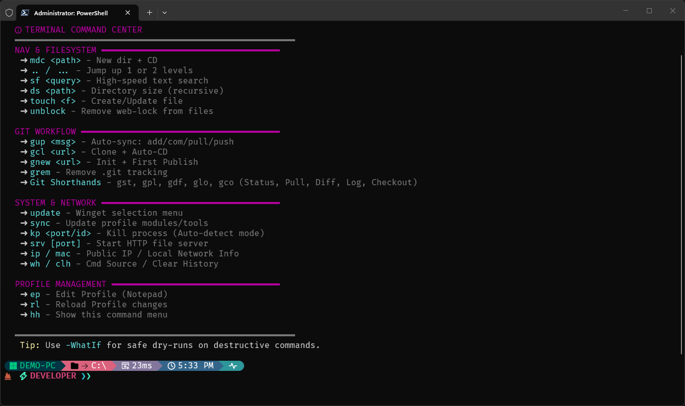

# ⚡ Supercharged Terminal
### A Professional PowerShell Environment for Windows


<br>


*Above: The fully configured terminal running Oh My Posh, Terminal Icons, and Predictive Autocomplete.*

<br>

## ✨ Key Features

- **Professional Feedback System**: Integrated status icons for Success, Info, Warning, Error, and Busy states.
- **Advanced Navigation**: Smart directory creation, recursive unblocking, and size calculation.
- **Git Power-User Tools**: "Platinum" repository initialization, auto-syncing, and decorated log graphs.
- **System Optimizer**: Port-aware process killing, Winget update manager, and terminal history purging.
- **Intelligent Autocomplete**: Predicting your next command based on deep history and plugin context.

<br>


<br>

## 🚀 Quick Start (Auto-Install)

The fastest way to get started is using the automated installer which configures your entire environment in seconds.

> [!CAUTION]
> **Administrator Privileges Required**: The installer requires Admin rights to install system-wide fonts and packages. The script will automatically request elevation if needed.

### The One-Liner
Run this in a standard PowerShell window:
```powershell
irm https://raw.githubusercontent.com/SiliconeShojo/Supercharged-Terminal/main/install.ps1 | iex
```

> [!TIP]
> This script handles PowerShell 7, Oh My Posh, FiraCode Nerd Font, and your profile configuration automatically.

<br>


<br>

## ⚠️ Final Step: Enable the Nerd Font
While the installer downloads the font, you **must** manually tell Windows Terminal to use it, otherwise icons will appear as broken squares (□).

1.  Open **Windows Terminal Settings** (`Ctrl + ,`).
2.  Go to **Profiles** -> **PowerShell** (or Defaults).
3.  Select **Appearance**.
4.  Set **Font Face** to `FiraCode Nerd Font`
5.  Click **Save**.

<br>


<br>

## 📖 Command Reference

For a complete list of commands, aliases, and detailed usage examples, please see the dedicated documentation page:

### 👉 [View Full Command Reference](COMMANDS.md)

---

### 🎨 Themes & Customization
Powered by **Oh My Posh**, you can switch styles instantly.

1.  **Browse:** Check the [Official Gallery](https://ohmyposh.dev/docs/themes).
2.  **Edit:** Run `pro`.
3.  **Change:** Update the `--config` path in the `oh-my-posh init` line.
4.  **Reload:** Run `ref`.

<br>


<br>

## 📊 Performance & Compatibility
*   **Engine**: Optimized for PowerShell 7.4+.
*   **Encoding**: Forced UTF-8 for icon fidelity.
*   **Async**: Posh-Git status is non-blocking.
*   **Compatibility**: Fallbacks included for PowerShell 5.1 where possible.

<br>

<p align="center">
  
</p>

<br>

*Terminal Supercharged. Happy Coding!* 🚀